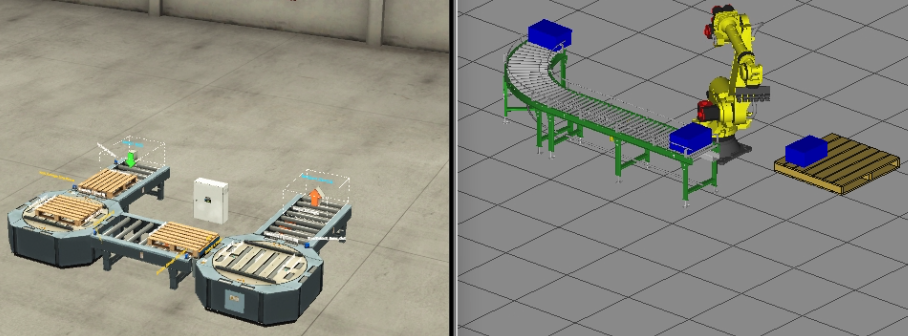

# Palletizing_Unit_FANUC_OPCUA_SCL_Vizualization
Good example of visualization meaning in moderm automation. OPCUA connection between TIA PORTAL and ROBOGUIDE

# About

Example of possibility to work with Industrial Automation using only a personal computer.  
Robot waiting for a pallet, when pallet is on palletizing place robot starts cycle and putting one layer of the product. After one layer pallet is allowed to leave the palletizing place.  
Program are fully tasted, presentation in link below:  

<strong> Palletizing Unit </strong> - https://youtu.be/doxMMUjiPlw  

# Tools

  
  
  
  
  

 
<strong> TiaPortal </strong>  
<strong> S7-PLCSIM Advanced </strong>  
<strong> OPC UA - KEPServerEX </strong>
